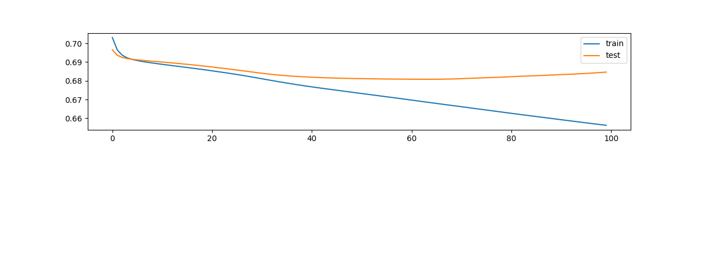

# OMX30 forecasting

An attempt to guess if OMX30 will go up or down tomorrow based on historical patterns.

The model is very simple in order to avoid overfitting and takes the following features as input:

  - up/down for 19 global stock market indexes (including the OMX30 itself) starting from 2014 in trading day frequency
  - Some explicit weekday awareness (to accomodate some [calendar effects](https://en.wikipedia.org/wiki/Calendar_effect))

A one layer LSTM model with only one unit is used. To make a prediction it is fed a one year long sequence of the input features. It outputs probabilities for OMX30 going down or up the following day.

## Result
When training on 70% of the data from 2014 and forward up until today it had 58% accuracy on the remaining 30%. Assuming up and down being just as likely that gives a p-value of less than 0.05

Keep in mind though that this result hasn't been thoroughly confirmed yet and that the historical patterns of the stock market can very well change in nature in the future of unknowns.

## Usage
My side project [Finsyn](https://app.finsyn.se) currently runs this on GAE in a opt-in alpha :)

## Requirements
 - python 2.7 
 - keras, pandas, matplotlib, scikitlearn, docker etc.
 - *training data that hopefully will be made available soon* 

## Development
TBD

## References

- [Multivariate Time Series Forecasting with LSTMs in Keras](https://machinelearningmastery.com/multivariate-time-series-forecasting-lstms-keras/) by Jason Brownlee
- [Deep Learning the Stock Market](https://medium.com/@TalPerry/deep-learning-the-stock-market-df853d139e02) by Tal Perry
- [On stock return prediction with LSTM networks](http://lup.lub.lu.se/luur/download?func=downloadFile&recordOId=8911069&fileOId=8911070) by Magnus Hansson

