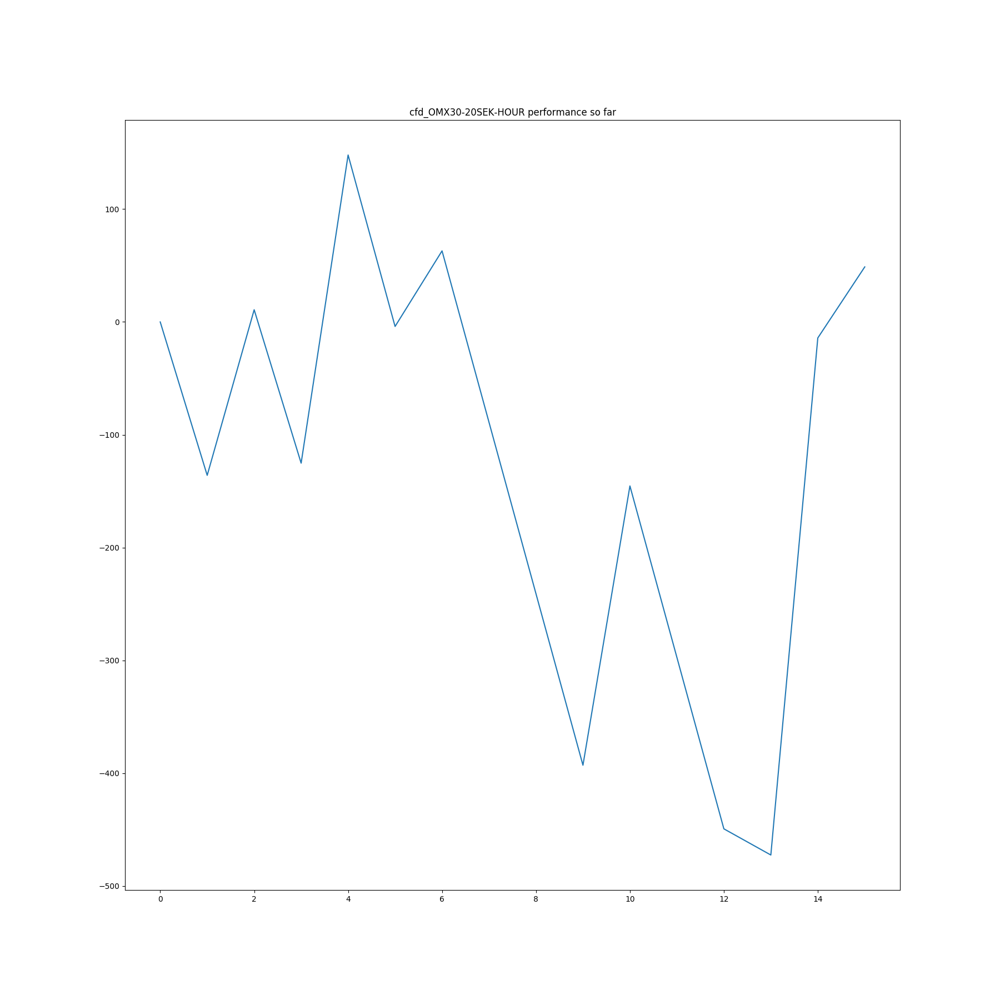

# Predicting tomorrows direction of index CFD:s

An attempt to predict if any given market index CFD on IG Markets will go up or down tomorrow based on historical patterns.

## Method 

Input to the model consists of historical data from multiple global stock and commodity indexes. The raw data from each financial indicator is transformed into a bunch of technical analysis features (moving averages etc.). These features are the same as the ones covered in the paper [Predicting the Direction of Stock Market Index Movement Using an Optimized Artificial Neural Network Model] by Mingyue Qiu and Yu Song. The top X among these features are then selected programmatically based on their forecasting value. These chosen features are fed to small neural network that outputs probabilities for the target CFD:s going up or down the following day.

## Result
**This hasn't been peer reviewed in any way**

### Sweden 30 CFD

The currently best performing model had 67% accuracy on a test set of 84 samples/days (p-value < 0.05). The feature selection was done based on the whole train+test set though which might not be best practice. Still I think that > 60% accuracy should be possible with this kind of model judging by the results found in other articles.

### Italy 40 CFD 
*under construction*

## Use cases

### Trading 
The model is currently being used to conduct real trades of OMX30-SEK20 CFD:s on ig.com. I am still experimenting quite a lot and has changed model and pipeline quite frequently recently.

Here is my financial "progress" so far:



The plan is to start trading with CFD:s for multiple markets simultaneously to offset the risk a bit.

### Publishing
My side project [Finsyn](https://app.finsyn.se) publishes daily prediction to a Messenger bot in an opt-in alpha channel :)


## Development

### Requirements
 - Docker
 - Docker Compose
 - GCP service account private key file to access BigQuery tables *Request one through [twitter DM](https://twitter.com/tornilssonohrn)*

### Run locally
Local runtime is powered by docker-compose. You need to set `TARGET` to one of the [targets](targets/). The available docker-compose services are:

- **etl:** Extract, transform and load data from BigQuery to CSV files ready to feed to training
- **train:** Automatic feature selection and training of model with some of the training samples set aside as test set for evaluation
- **view:** Generates plots to understand the data. Outputs PNG:s to the [plots dir](plots/) 
- **train-dist:** Trains the final model used for predictions. Now all the training samples are used since there is no more need for a test set.
- **predict:** Run a prediction for tomorrow using the trained model 

Example:
```
TARGET=omx docker-compose run etl
```

## Lessons learned
Generally I've noticed quite a clash between theory and the real world. It seems possible to make predictions better than a cointoss but to actually make money out of those predictions is harder.

Here are some problems I've encountered along the way:

### 1. Underlying instrument vs IG CFD:s 
Once I started letting a model trained on OMX30 data from Yahoo finance play with real money I noticed that the opening price I got on IG CFD on market opening didn't match what is advertised by Yahoo (which seems to match Nasdaq). The intraday market direction of the CFD and the actual underlying index seems to be the same only about ~80% of the time the last year.

```
start = datetime(2017, 5, 29)
end = datetime(2018, 5, 25)

IG vs Yahoo/Nasdaq intraday diff direction matches (OMX30)
count      240
unique       2
top       True
freq       200
```

Opening prices during the same timespan differed about 4 points on average with a median of 3.

Altogether this made me move from trying to predict OMX30 to predicting the OMX30 CFD instead.

### 2. National holidays
I currently try to remove all data points from dates where the underlying market of the target CFD is closed. It's quite a hazzle to accurately mark holidays in some markets (lunar calendar etc.) *To be further elaborated on*

## References

- [The calendar effect](https://en.wikipedia.org/wiki/Calendar_effect)
- [Multivariate Time Series Forecasting with LSTMs in Keras](https://machinelearningmastery.com/multivariate-time-series-forecasting-lstms-keras/) by Jason Brownlee
- [Deep Learning the Stock Market](https://medium.com/@TalPerry/deep-learning-the-stock-market-df853d139e02) by Tal Perry
- [On stock return prediction with LSTM networks](http://lup.lub.lu.se/luur/download?func=downloadFile&recordOId=8911069&fileOId=8911070) by Magnus Hansson
- [Predicting the Direction of Stock Market Index Movement Using an Optimized Artificial Neural Network Model]:https://www.ncbi.nlm.nih.gov/pmc/articles/PMC4873195/
